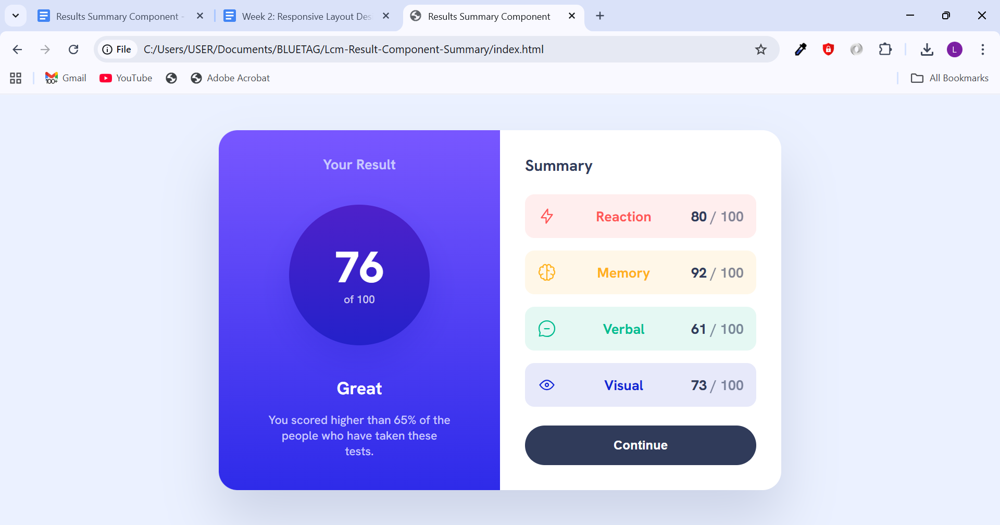

# Lcm Result Component Summary

A responsive results compent summary card built with HTML and CSS.

It displays a user’s result on the left and a detailed category breakdown on the right.

# Screenshots

### Desktop View

### Mobile View

### Hover State

## Live Site Link

[View Live Demo on Netlify]()

## Technologies Used

HTML
CSS
